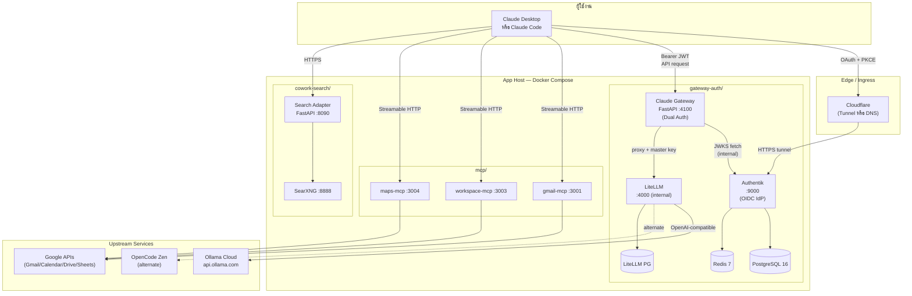
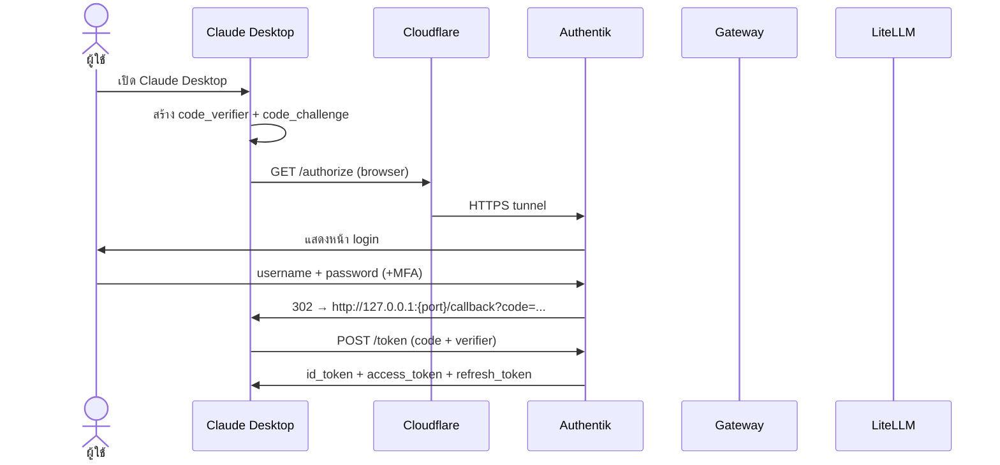
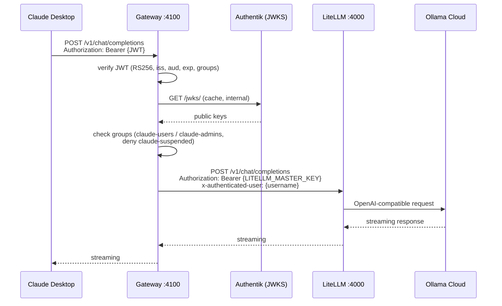
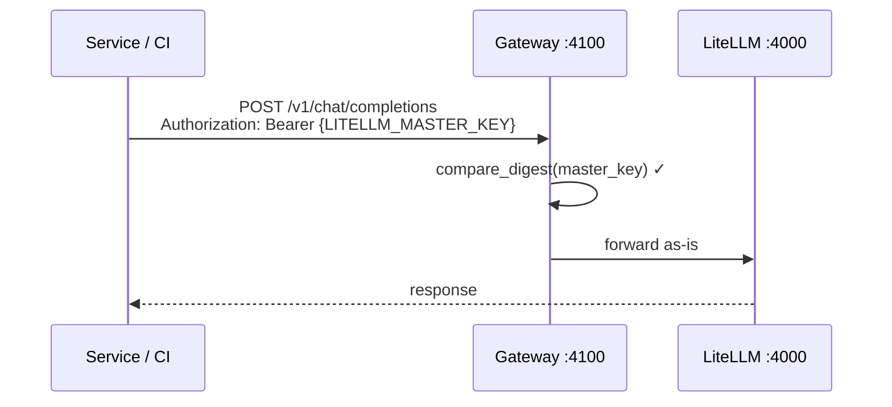

# Claude 3P — Claude Desktop / Cowork 3P Platform

> **Monorepo** สำหรับรัน **Claude Desktop / Claude Code** ผ่าน third-party inference และ OIDC SSO
> พร้อม MCP services สำหรับ Google Workspace + web search ผ่าน SearXNG

[]()
[]()
[]()
[]()
[]()

---

## ภาพรวมระบบ (System Overview)

`claude-3P` คือชุดระบบที่ทำให้ผู้ใช้ล็อกอินด้วย **OIDC SSO** (Authentik) แล้วเรียก Claude / open-source LLM
ผ่าน **LiteLLM proxy** ได้จาก Claude Desktop / Claude Code โดยตรง พร้อม MCP tools สำหรับงานเอกสาร
(Gmail, Calendar, Sheets/Docs/Drive, Maps) และ web search ผ่าน SearXNG — โดยไม่ต้องส่งข้อมูลออก Anthropic API โดยตรง

### Component Diagram



---

## โครงสร้าง Monorepo (Repository Layout)

```
claude-3P/
├── README.md                      ← (this file) — overview + component map
├── .gitignore                     ← ครอบคลุม secrets, node_modules, .env, builds
│
├── gateway-auth/                  ← 🔐 OIDC SSO + AI Gateway (หัวใจของระบบ)
│   ├── compose.yml                ← root compose (include 2 stacks)
│   ├── .env.example               ← env รวมทุก service
│   ├── docs/
│   │   ├── architecture.md        ← auth flow, decision matrix, container table
│   │   ├── runbook.md             ← deploy + operations
│   │   └── cloudflare.md          ← tunnel/DNS config (operator runbook)
│   ├── authentik/                 ← Authentik 2025.10.0 (Postgres + Redis + Server/Worker)
│   │   ├── blueprints/
│   │   │   └── claude-desktop.yaml  ← GitOps IdP: groups, client, token TTL
│   │   ├── nginx/                 ← reverse proxy (VM + DNS mode)
│   │   ├── scripts/               ← generate-secrets, backup, verify-oidc
│   │   └── docs/                  ← production hardening, troubleshooting
│   └── ollama-litellm/            ← FastAPI gateway + LiteLLM proxy
│       ├── config.yaml            ← model routing
│       ├── docker-compose.yml
│       ├── claude-3P.md           ← overview การใช้ Bedrock / 3P inference
│       ├── mermaid.md             ← model routing diagram
│       └── gateway/               ← FastAPI source
│           ├── app/               ← main, auth, oidc, proxy, middleware
│           └── tests/             ← pytest + respx
│
├── mcp/                           ← 🔌 MCP Servers (Streamable HTTP)
│   └── gmail-mcp/                 ← Google Workspace + Gmail + Maps MCP
│       ├── compose.yaml
│       ├── README.md
│       ├── howtosetup.md          ← OAuth setup guide
│       ├── services/
│       │   ├── gmail-mcp/         ← Gmail API
│       │   ├── workspace-mcp/     ← Sheets + Docs + Drive
│       │   └── maps-mcp/          ← Google Maps
│       ├── packages/
│       │   └── google-auth/       ← shared OAuth + MCP factory
│       └── secrets/               ← (gitignored) OAuth tokens
│
├── cowork-search/                 ← 🔎 Web search ผ่าน SearXNG (self-hosted)
│   ├── docker-compose.yml
│   ├── adapter/                   ← FastAPI HTTPS adapter (port 8090)
│   ├── searxng/                   ← SearXNG settings
│   └── certs/                     ← self-signed cert สำหรับ local HTTPS
│
├── docs/
│   └── superpowers/
│       └── plans/
│           └── 2026-07-23-gateway-auth-implementation.md
│                                    ← SDD plan ต้นฉบับของ gateway-auth
│
└── show-case/                     ← 📸 ตัวอย่าง output จริงจาก Claude
    ├── case01/                    ← legal/liquor excise case study
    └── case02-schedule/           ← OT roster automation (xlsx outputs)
```

---

## Component Map — ใครทำอะไร

| Component | Path | หน้าที่ | Port | Auth |
|---|---|---|---|---|
| **Authentik** | `gateway-auth/authentik/` | OIDC Identity Provider (groups, clients, tokens) | `9000` (internal) | — |
| **Claude Gateway** | `gateway-auth/ollama-litellm/gateway/` | FastAPI: dual auth (JWT + master key) → proxy to LiteLLM | `4100` | JWT (RS256) + master key |
| **LiteLLM** | `gateway-auth/ollama-litellm/` | OpenAI-compatible proxy → upstream LLMs (Ollama Cloud, OpenCode) | `4000` (internal only) | master key |
| **Gmail MCP** | `mcp/gmail-mcp/services/gmail-mcp/` | MCP server: อ่าน/เขียน email | `3001` | OAuth (Google) |
| **Workspace MCP** | `mcp/gmail-mcp/services/workspace-mcp/` | MCP server: Sheets, Docs, Drive | `3003` | OAuth (Google) |
| **Maps MCP** | `mcp/gmail-mcp/services/maps-mcp/` | MCP server: Google Maps | `3004` | API Key |
| **SearXNG** | `cowork-search/searxng/` | Meta-search engine (self-hosted) | `8888` | — |
| **Search Adapter** | `cowork-search/adapter/` | HTTPS-fronted wrapper รอบ SearXNG | `8090` | TLS self-signed |

---

## การเชื่อมโยงของระบบ (Data Flow)

### 1. Login Flow — ครั้งแรก (OAuth + PKCE)



### 2. Inference Flow — ทุก API call



### 3. Service / Automation — master key path



> หลักการ: **gateway เป็นคน terminate user auth** เสมอ ไม่ว่า caller เป็นใคร
> JWT user → swap to master key + เพิ่ม identity headers
> Master-key caller → ส่งต่อตามต้นฉบับ

---

## เริ่มต้นใช้งาน (Quick Start)

### Prerequisites

- Docker Desktop (หรือ Docker Engine + Compose v2)
- โดเมนของตัวเองบน Cloudflare (ถ้าจะ deploy โหมด tunnel)
- Google Cloud project + OAuth client (Desktop app) สำหรับ MCP

### 1) Clone & setup

```sh
git clone https://github.com/ZeroDayWorks/claude-3p.git
cd claude-3p

# สร้าง .env จากตัวอย่าง (ทำทุก component ที่ใช้)
cp gateway-auth/.env.example gateway-auth/.env
cp mcp/gmail-mcp/.env.example mcp/gmail-mcp/.env

# generate secrets
cd gateway-auth
./authentik/scripts/generate-secrets.sh >> .env   # PG_PASS, AUTHENTIK_SECRET_KEY
cd ../..
```

### 2) Start gateway-auth (core)

```sh
cd gateway-auth
docker compose up -d                  # โหมด VM + DNS
# หรือ
docker compose --profile tunnel up -d # โหมด local + Cloudflare tunnel
```

ตรวจสอบ:

```sh
docker compose ps
curl http://localhost:4100/health     # gateway
curl http://127.0.0.1:4000/health/liveliness  # ต้อง fail (port ถูก expose เฉพาะ internal)
```

### 3) Start MCP services

```sh
cd mcp/gmail-mcp
# วาง secrets/credentials.json ก่อน
docker compose --profile auth up -d gmail-auth    # OAuth ครั้งแรก
# เปิด http://localhost:3101 → login → บันทึก token
docker compose up -d                               # services หลัก
```

### 4) Start cowork-search

```sh
cd cowork-search
docker compose up -d
# adapter ฟังที่ https://localhost:8090 (self-signed cert)
```

### 5) ตั้ง Claude Desktop

| Field | Value |
|---|---|
| Base URL | `http://localhost:4100` |
| API Key | `LITELLM_MASTER_KEY` (ค่าใน `gateway-auth/.env`) |
| MCP servers | `http://127.0.0.1:3001/mcp` (Gmail), `3003/mcp` (Workspace), `3004/mcp` (Maps) |

สำหรับ OAuth SSO: เปิด Claude Desktop แล้ว login ผ่าน `https://${AUTH_DOMAIN}/application/o/authorize/`
(ดูรายละเอียดที่ [gateway-auth/docs/runbook.md](gateway-auth/docs/runbook.md))

---

## เอกสารเพิ่มเติม (Component-level Docs)

| Component | เอกสารหลัก | เอกสารอ้างอิง |
|---|---|---|
| **gateway-auth (overall)** | [README](gateway-auth/authentik/README.md) | [Architecture](gateway-auth/docs/architecture.md) · [Runbook](gateway-auth/docs/runbook.md) · [Cloudflare](gateway-auth/docs/cloudflare.md) · [Original Plan](gateway-auth/gateway-auth-plan.md) |
| **Authentik** | [README](gateway-auth/authentik/README.md) | [Installation](gateway-auth/authentik/docs/installation.md) · [Production Hardening](gateway-auth/authentik/docs/production-hardening.md) · [Architecture](gateway-auth/authentik/docs/architecture.md) |
| **Claude Gateway (FastAPI)** | [README](gateway-auth/ollama-litellm/gateway/README.md) | [3P overview](gateway-auth/ollama-litellm/claude-3P.md) |
| **MCP (Google Workspace)** | [README](mcp/gmail-mcp/README.md) | [OAuth setup](mcp/gmail-mcp/howtosetup.md) |
| **Cowork Search** | — | [SearXNG settings](cowork-search/searxng/settings.yml) |
| **SDD Plan** | [2026-07-23 plan](docs/superpowers/plans/2026-07-23-gateway-auth-implementation.md) | — |

---

## Security Model — สรุปสั้น

- **JWT verification:** RS256 only, JWKS cached, `iss`/`aud`/`exp` required, 30s leeway
- **Anti-spoofing:** client-supplied `x-authenticated-user`/`x-authenticated-sub` ถูก strip เสมอ
- **Algorithm lockdown:** ปฏิเสธ `alg: none` และ HS256 (กัน algorithm confusion)
- **JWKS stale-while-error:** ถ้า Authentik ล่ม ใช้ cache เดิมถ้ามี; ไม่มี → 503 (fail closed)
- **LiteLLM isolation:** port `4000` expose เฉพาะ internal network — bypass gateway ไม่ได้
- **MCP isolation:** bind เฉพาะ `127.0.0.1` ไม่เปิดออก internet
- **Secret hygiene:** `.env`, `secrets/`, `*.pem`, `token*.json` ถูก ignore ทั้งหมด
- **RBAC groups:** `claude-users` (allow), `claude-admins` (allow), `claude-suspended` (deny)

ดูรายละเอียดครบที่ [gateway-auth/docs/architecture.md](gateway-auth/docs/architecture.md)

---

## Known Limitations / Trade-offs

| Item | Note | Mitigation |
|---|---|---|
| **8h access token TTL (demo)** | Revocation gap สูงสุด 8 ชม. | แก้ใน `authentik/blueprints/claude-desktop.yaml` → `minutes=15` |
| **Single master key for all users** | Spend tracking ต่อ user ยังไม่แยก | ปู `x-authenticated-sub` ไว้แล้ว → ต่อยอดเป็น virtual keys |
| **Inference ไม่ผ่าน Cloudflare** | หลีกเลี่ยง 100s idle timeout บน streaming | เรียก gateway ตรง (localhost/LAN) |
| **Cloudflare Tunnel token** | Secret ใหม่ต้องตั้งเอง (ไม่ควร commit) | ใส่ใน `.env` ตอน deploy |
| **calendar-mcp** | โฟลเดอร์ `mcp/google-calendar/` ว่าง (รอ merge จาก feature branch) | ใช้ Gmail + Workspace MCP แทนได้ในระหว่างนี้ |

---

## Contributing

1. แยก branch ต่อ component
2. ห้าม commit secrets, `.env`, `node_modules/`, `dist/`, `__pycache__/`
   (ดู `.gitignore` ระดับ root)
3. รักษาเอกสารใน `gateway-auth/docs/` ให้ตรงกับการเปลี่ยนแปลง
4. เมื่อแก้ `gateway-auth/`: รัน `docker compose config` ให้ผ่านทั้งโหมดปกติและ `--profile tunnel`
5. เมื่อแก้ MCP: รัน `npm run check && npm test` ใน service ที่แตะ

---

## License & Attribution

Internal/demo project. Components:

- [Authentik](https://goauthentik.io/) — MIT
- [LiteLLM](https://github.com/BerriAI/litellm) — MIT
- [SearXNG](https://github.com/searxng/searxng) — AGPL-3.0
- [Model Context Protocol (MCP)](https://modelcontextprotocol.io/) — MIT
- [FastAPI](https://fastapi.tiangolo.com/) — MIT
- [PyJWT](https://github.com/jpadilla/pyjwt) — MIT
