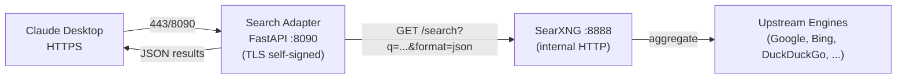

# cowork-search

> **Web search** สำหรับ Claude Desktop / Claude Code ผ่าน **SearXNG** (self-hosted
> meta-search) + **FastAPI adapter** ที่ห่อ HTTPS

ทำไมต้องห่อ HTTPS?
- Claude บาง client ต้องการ endpoint ที่เป็น HTTPS เท่านั้น
- SearXNG ส่งออก HTML/JSON เป็น HTTP → adapter เป็น HTTPS-fronted wrapper

## Architecture



## Components

| Service | Image | Port (host) | Port (container) | Network |
|---|---|---|---|---|
| `searxng` | `docker.io/searxng/searxng:latest` | `8888` | `8080` | `search-network` |
| `adapter` | custom (`./adapter/Dockerfile`) | `8090` | `8090` (HTTPS) | `search-network` |

## Setup

```sh
cd cowork-search
docker compose up -d
```

ตรวจ:

- SearXNG: `http://localhost:8888`
- Adapter: `https://localhost:8090/health` (self-signed cert → ยอมรับ warning ครั้งแรก)
- Search: `curl -k -X POST https://localhost:8090/search -H "Content-Type: application/json" -d '{"q":"test"}'`

## API

### `GET /health`

```json
{ "status": "ok", "searxng": "http://searxng:8080" }
```

### `POST /search`

Request:
```json
{ "q": "Claude 3.5 Sonnet" }
```

Response (top 10):
```json
{
  "results": [
    {
      "title": "...",
      "url": "...",
      "content": "..."
    }
  ]
}
```

## Files

```
cowork-search/
├── docker-compose.yml        # searxng + adapter
├── adapter/
│   ├── Dockerfile            # python:3.12-slim + uvicorn
│   ├── main.py               # FastAPI app (POST /search, GET /health)
│   └── requirements.txt      # fastapi, uvicorn[standard], httpx
├── searxng/
│   └── settings.yml          # SearXNG config (safe_search=0, json+html)
└── certs/                    # self-signed cert (regenerate with openssl)
    ├── cert.pem
    └── key.pem
```

## Regenerate self-signed cert

```sh
cd cowork-search/certs
openssl req -x509 -newkey rsa:4096 -nodes \
  -keyout key.pem -out cert.pem -days 365 \
  -subj "/CN=localhost" \
  -addext "subjectAltName=DNS:localhost,IP:127.0.0.1"
```

## Notes

- `searxng/settings.yml` มี `secret_key` ของเดิม commit อยู่ — ถ้าใช้ public-facing
  instance ต้อง generate ใหม่: `openssl rand -hex 32`
- Adapter ใช้ self-signed cert เพื่อ demo เท่านั้น — production ใช้ Let's Encrypt หรือ
  Cloudflare origin cert
