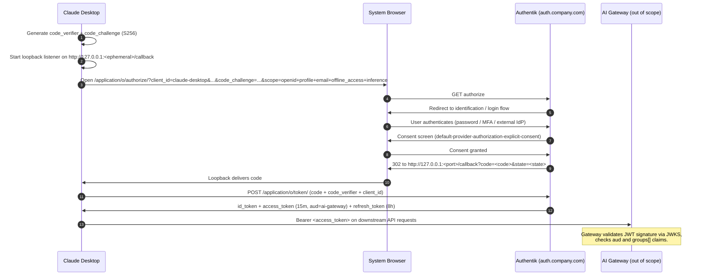
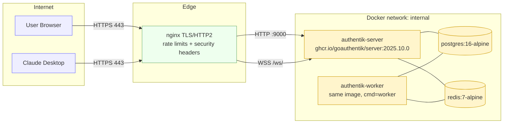

# Architecture

## OIDC login flow (Claude Desktop, public client + PKCE)

Key properties:

- **Public client**, no client secret. PKCE S256 required.
- Redirect URI is a **regex** allowing any loopback port
  (`^http://127\.0\.0\.1:[0-9]{1,5}/callback$`) per RFC 8252.
- Access token lifetime **15 minutes**; refresh token **8 hours**.
- `id_token` includes claims.
- Custom `inference` scope adds `groups`, `roles`, and `aud=ai-gateway` to the
  access token so downstream can enforce audience-based authorization.

## Service topology

- Only `nginx` is exposed to the internet.
- DB and Redis have **no** host port bindings.
- Server + worker share the same image; role is chosen by `command:`.
- Blueprints live in `./blueprints/` bind-mounted at `/blueprints/custom` (read-only).
