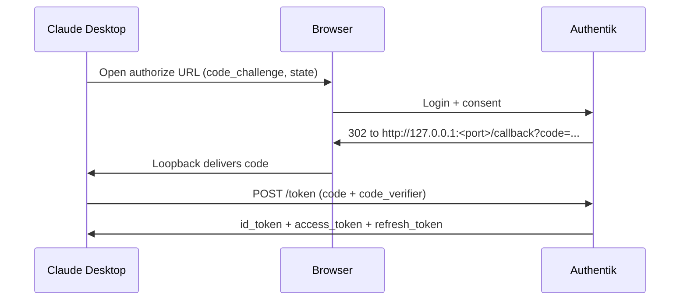

# Claude Desktop setup

Configure Claude Desktop's **External IdP / Custom OIDC Provider** with the
values below.

## Flow (recap)



## Field-by-field

| Field                          | Value                                                              |
|--------------------------------|--------------------------------------------------------------------|
| Gateway auth scheme            | `bearer`                                                           |
| Credential kind                | Interactive sign-in                                                |
| Client ID                      | `claude-desktop`                                                   |
| Client secret                  | *(leave blank - public client)*                                    |
| Issuer URL                     | `https://auth.company.com/application/o/claude-desktop/`           |
| Discovery URL (if separate)    | `https://auth.company.com/application/o/claude-desktop/.well-known/openid-configuration` |
| Scopes                         | `openid profile email inference`                                   |
| Additional scopes (append)     | `offline_access`                                                   |
| PKCE                           | Enabled (S256)                                                     |
| Redirect / callback            | `http://127.0.0.1:<ephemeral>/callback` (loopback per RFC 8252)    |
| Ephemeral port                 | Yes - let Claude Desktop pick an unused port                       |
| Additional redirect/referrer hosts | *(leave empty)*                                                |

Note on scopes: enter `openid profile email inference` in the main scopes
field and add `offline_access` in the appendable/optional field. This yields
a request for all five scopes and Authentik will issue a refresh token
because of `offline_access`.

## What to expect on first sign-in

1. Claude Desktop opens your system browser to Authentik.
2. You authenticate with your directory credentials (and MFA if enrolled).
3. Authentik shows the consent screen listing the requested scopes.
4. On approval, the browser hands off to a `http://127.0.0.1:<port>/callback`
   URL that Claude Desktop is listening on. This is normal and expected.
5. Claude Desktop exchanges the code for tokens and closes the browser tab.

## Verifying the token contents (optional, for admins)

Decode the access token payload (do **not** paste tokens into public
websites). A correct token should contain at minimum:

```json
{
  "iss": "https://auth.company.com/application/o/claude-desktop/",
  "aud": "ai-gateway",
  "sub": "<opaque>",
  "groups": ["claude-users"],
  "roles":  ["claude-users"],
  "exp": <15m from iat>,
  "iat": <now>
}
```

If `aud` is missing, the client did not request the `inference` scope. If
`groups` is empty, the user is not in `claude-users` / `claude-admins` and
the policy binding should have blocked the login - re-check group
membership.

## Troubleshooting

See [troubleshooting.md](troubleshooting.md).
