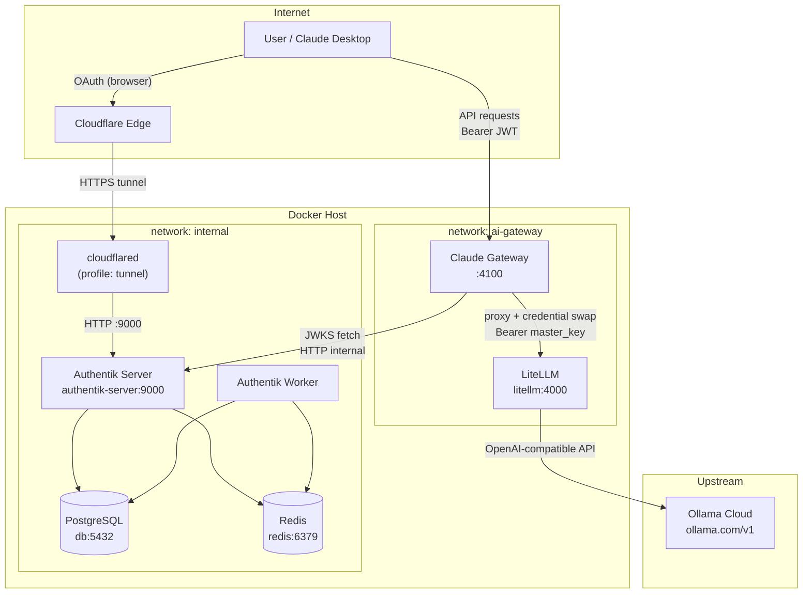
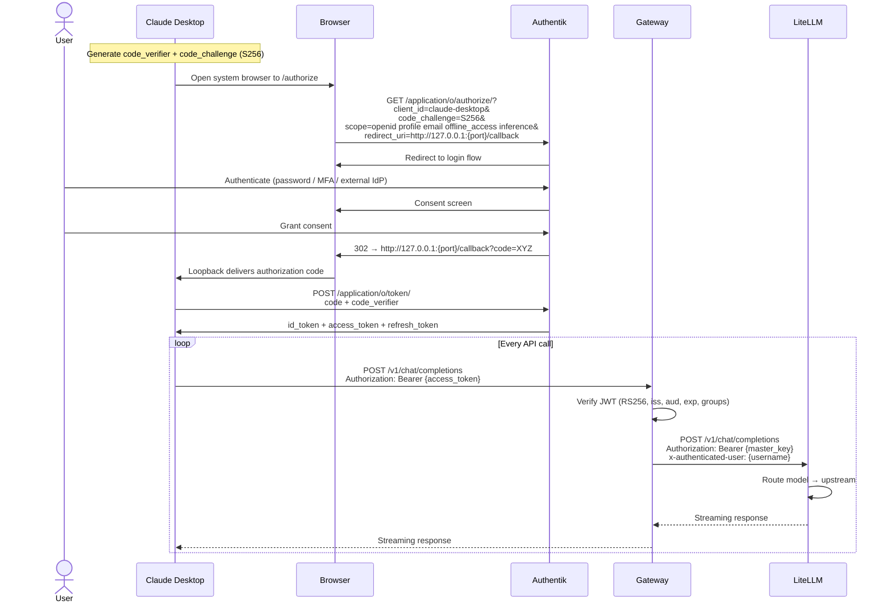
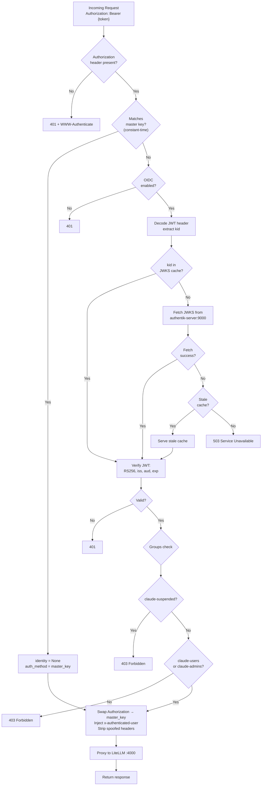
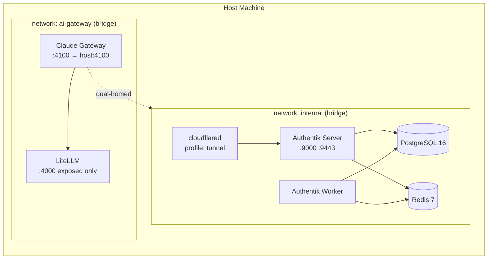

# Gateway Auth — Architecture

## System Overview



## Authentication Flow (OIDC + PKCE)



## Request Flow (Inference)



## Service Topology



## Container Details

| Service | Image | Port (container) | Port (host) | Network | Healthcheck |
|---------|-------|------------------|-------------|---------|-------------|
| `db` | `postgres:16-alpine` | 5432 | — | `internal` | `pg_isready` |
| `redis` | `redis:7-alpine` | 6379 | — | `internal` | `redis-cli ping` |
| `server` | `goauthentik/server:2025.10.0` | 9000, 9443 | — (dev: 127.0.0.1:9000) | `internal` | `ak healthcheck` |
| `worker` | `goauthentik/server:2025.10.0` | — | — | `internal` | `ak healthcheck` |
| `claude-gateway` | custom `gateway/Dockerfile` | 4100 | 4100 | `ai-gateway` + `internal` | `GET /health` |
| `litellm` | `berriai/litellm:main-latest` | 4000 | — | `ai-gateway` | `GET /health/liveliness` |
| `cloudflared` | `cloudflare/cloudflared:latest` | — | — | `internal` | — |

## Gateway API Endpoints

| Method | Path | Auth | Description |
|--------|------|------|-------------|
| `GET` | `/health` | No | Gateway health check |
| `GET` | `/ready` | No | Gateway + LiteLLM readiness |
| `GET` | `/` | No | HTML dashboard |
| `GET` | `/web` | No | HTML dashboard |
| `GET` | `/api/gateway/info` | No | Dashboard JSON |
| `GET` | `/api/web/domain_info?domain=` | Yes | Domain allowlist check |
| `GET` | `/claude-desktop/api/web/domain_info?domain=` | Yes | Claude Desktop domain check |
| `ANY` | `/{path:path}` | Yes | Catch-all proxy → LiteLLM |

## Auth Decision Matrix

| Scenario | Response |
|----------|----------|
| No `Authorization` header | `401` + `WWW-Authenticate: Bearer` |
| Valid master key | `identity=None`, pass through |
| Valid JWT, allowed group | `identity` set, credential swapped |
| Valid JWT, `claude-suspended` | `403 Forbidden` |
| Valid JWT, no allowed group | `403 Forbidden` |
| Expired JWT | `401` |
| Wrong `aud` / `iss` | `401` |
| Wrong signing key | `401` |
| HS256 algorithm (confusion attack) | `401` |
| JWKS unreachable, no cache | `503` |
| JWKS unreachable, stale cache | `200` (stale-while-error) |
| OIDC disabled + JWT | `401` (master key only) |

## Model Routing

| Client Model | Upstream |
|-------------|----------|
| `glm-5.2` | `openai/glm-5.2:cloud` |
| `deepseek-v4-pro` | `openai/deepseek-v4-pro:cloud` |
| `kimi-k2.7-code` | `openai/kimi-k2.7-code:cloud` |
| `sonnet` / `claude-sonnet-4-5` / `anthropic/claude-sonnet-4-5` | `openai/kimi-k2.7-code:cloud` |
| `opus` / `mythos` | `openai/deepseek-v4-pro:cloud` |
| `haiku` / `fable` | `openai/glm-5.2:cloud` |

All models route to `https://ollama.com/v1` via OpenAI-compatible API.

## Authentik Blueprint (Provisioned Automatically)

| Resource | Value |
|----------|-------|
| **Groups** | `claude-users`, `claude-admins`, `claude-suspended` |
| **Client ID** | `claude-desktop` (public, PKCE) |
| **Redirect URIs** | `^http://127\.0\.0\.1:[0-9]{1,5}/callback$` |
| **Grant Types** | `authorization_code`, `refresh_token` |
| **Access Token TTL** | 8h (demo) |
| **Refresh Token TTL** | 24h |
| **Signing Key** | Authentik self-signed certificate |
| **Policy** | Deny `claude-suspended`; require `claude-users` or `claude-admins` |

## Key Design Decisions

1. **Dual-homed gateway** — `claude-gateway` connects to both `ai-gateway` (LiteLLM) and `internal` (Authentik JWKS), avoiding internet round-trips for token verification.

2. **Credential swapping** — User JWT is replaced with LiteLLM master key before proxying. LiteLLM never sees user tokens. Identity forwarded via `x-authenticated-user` / `x-authenticated-sub`.

3. **Anti-spoofing** — Client-supplied `x-authenticated-user` and `x-authenticated-sub` headers are always stripped.

4. **Algorithm lockdown** — Only `RS256` accepted. HS256 and others rejected to prevent algorithm confusion attacks.

5. **Stale-while-error** — JWKS cache serves stale data if Authentik is unreachable (availability over freshness).

6. **LiteLLM port hardening** — Port 4000 is `expose`d but not `ports`-published. All traffic must go through the gateway.

7. **Inference bypasses Cloudflare** — Only OAuth browser flows use the tunnel. Inference stays local to avoid Cloudflare's 100s idle timeout on streaming.

8. **Single Compose project** — Uses `include:` to merge three compose files, enabling cross-service networking without external networks.

## Directory Structure

```
gateway-auth/
├── compose.yml                    # Root compose (includes sub-compose + cloudflared profile)
├── .env                           # All secrets (git-ignored)
├── .env.example                   # Env template
├── runbook.md                     # Setup runbook
├── cloudflare.md                  # Cloudflare tunnel config
├── docs/
│   └── architecture.md            # This file
├── authentik/
│   ├── compose.yml                # db, redis, server, worker
│   ├── compose.override.yml       # Dev: expose 9000/9443 on loopback
│   ├── blueprints/
│   │   └── claude-desktop.yaml    # Idempotent blueprint
│   ├── nginx/                     # TLS + reverse proxy (VM+DNS mode)
│   ├── scripts/                   # generate-secrets, bootstrap, verify-oidc, backup, restore
│   └── docs/                      # Authentik-specific docs
└── ollama-litellm/
    ├── docker-compose.yml         # claude-gateway + litellm
    ├── config.yaml                # Model routing
    └── gateway/
        ├── Dockerfile
        ├── app/
        │   ├── main.py            # FastAPI app + routes
        │   ├── config.py          # Pydantic settings
        │   ├── auth.py            # Dual auth (master key + JWT)
        │   ├── oidc.py            # JWKS cache + JWT verification
        │   ├── proxy.py           # Request proxying + credential swap
        │   ├── middleware.py       # Request context + access logging
        │   ├── domain_policy.py   # Domain allowlist
        │   ├── dashboard.py       # HTML dashboard
        │   └── logging_config.py  # JSON log formatter
        └── tests/
            ├── test_auth.py
            ├── test_oidc.py
            ├── test_proxy.py
            ├── test_domain_policy.py
            ├── test_dashboard.py
            └── test_config.py
```
