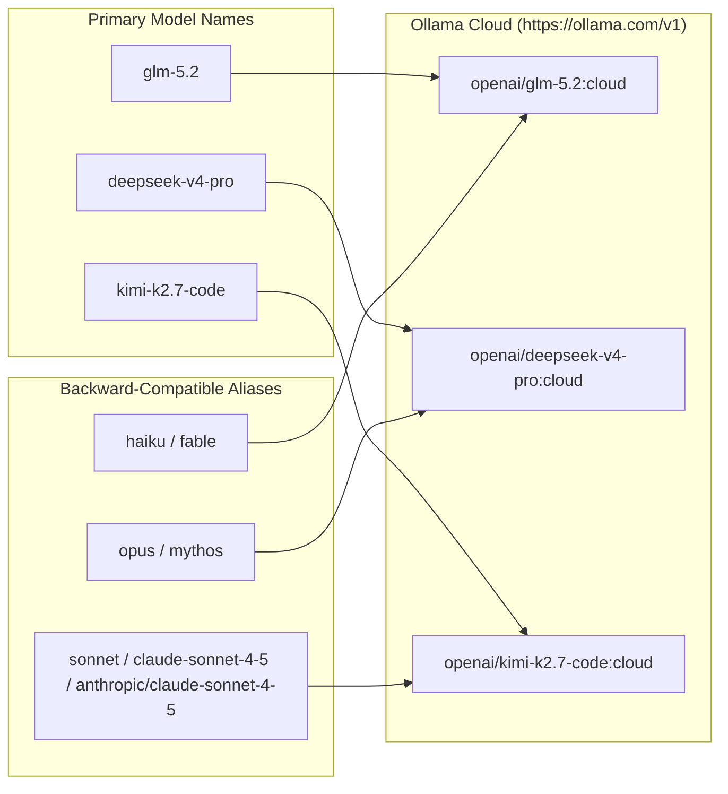

# Model Routing Diagram

LiteLLM proxy routes model name หลักและ alias เดิมไปที่ Ollama Cloud ผ่าน OpenAI-compatible API

https://github.com/aws-solutions-library-samples/guidance-for-claude-code-with-amazon-bedrock/blob/main/assets/docs/COWORK_3P.md

https://github.com/farion1231/cc-switch/issues/3136

